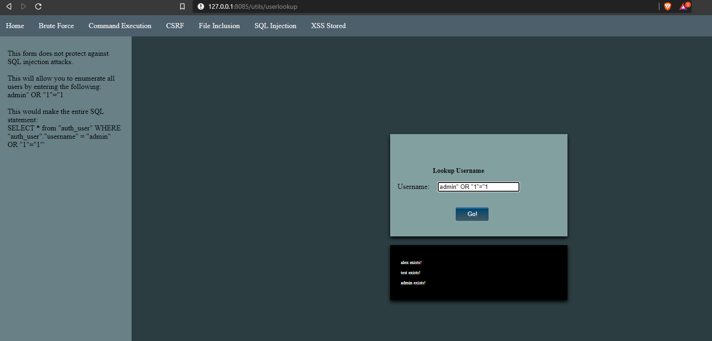

<!--
*** Thanks for checking out this README Template. If you have a suggestion that would
*** make this better, please fork the repo and create a pull request or simply open
*** an issue with the tag "enhancement".
*** Thanks again! Now go create something AMAZING! :D
***
***
***
*** To avoid retyping too much info. Do a search and replace for the following:
*** lambrou, vulnerable-django-app, twitter_handle, email
-->


<!-- PROJECT SHIELDS -->
<!--
*** I'm using markdown "reference style" links for readability.
*** Reference links are enclosed in brackets [ ] instead of parentheses ( ).
*** See the bottom of this document for the declaration of the reference variables
*** for contributors-url, forks-url, etc. This is an optional, concise syntax you may use.
*** https://www.markdownguide.org/basic-syntax/#reference-style-links
-->


<br />
<p align="center">

  <h3 align="center">Vulnerable Django App</h3>

  <p align="center">
    An example of an extremely vulnerable Django application.
    <br />
    <br />
    ·
    <a href="https://github.com/lambrou/vulnerable-django-app/issues">Report Bug</a>
    ·
    <a href="https://github.com/lambrou/vulnerable-django-app/issues">Request Feature</a>
  </p>
</p>


<!-- TABLE OF CONTENTS -->
## Table of Contents

* [About the Project](#about-the-project)
  * [Built With](#built-with)
* [Getting Started](#getting-started)
  * [Prerequisites](#prerequisites)
  * [Installation](#installation)
* [Contributing](#contributing)
* [License](#license)
* [Acknowledgements](#acknowledgements)


<!-- ABOUT THE PROJECT -->
## About The Project



### Built With

* [Python 3.8.2](https://www.python.org/downloads/)
* [Django 3.0.5](https://www.djangoproject.com/)


<!-- GETTING STARTED -->
## Getting Started

Currently only tested and supported on Windows.

### Prerequisites

* Django
```sh
pip install django
```

### Installation

1. Clone the repo
```sh
git clone https://github.com/lambrou/vulnerable-django-app.git
```
2. Run the server
```sh
python manage.py runserver 0.0.0.0:8085
```
If you want to access the server from another machine (not on LAN), you will need to forward port 8085 (or whatever port you wish to use) from your router.


<!-- CONTRIBUTING -->
## Contributing

Contributions are **greatly appreciated**.

1. Fork the Project
2. Create your Feature Branch (`git checkout -b feature/AmazingFeature`)
3. Commit your Changes (`git commit -m 'Add some AmazingFeature'`)
4. Push to the Branch (`git push origin feature/AmazingFeature`)
5. Open a Pull Request


<!-- LICENSE -->
## License

Distributed under the MIT License. See `LICENSE` for more information.


<!-- ACKNOWLEDGEMENTS -->
## Acknowledgements

* [othneildrew](https://github.com/othneildrew/Best-README-Template) - For this wonderful README template.